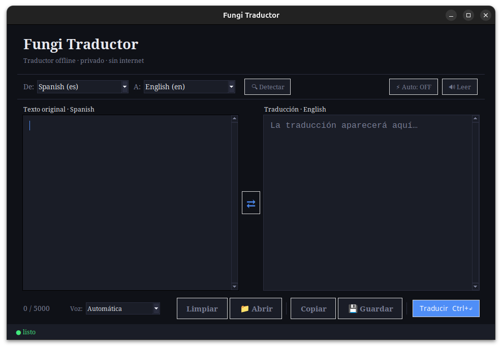

# Fungi Traductor



Traductor offline de alto rendimiento con interfaz gráfica moderna, diseñado para ofrecer privacidad total, velocidad y una experiencia de usuario profesional. Basado en el motor de **Argos Translate**, permite traducir textos, imágenes y documentos sin conexión a internet entre múltiples idiomas.

---

## ✨ Características Premium

- **🌐 100% Offline**: Privacidad garantizada. Tus textos nunca salen de tu equipo.
- **📄 Soporte de Documentos**: Traduce archivos completos cargándolos con un clic.
  - Soporta: **.txt, .pdf, .docx (Word), .odt (OpenDocument)**.
- **🖼️ Reconocimiento de Imágenes (OCR)**: Extrae y traduce texto de imágenes **.png, .jpg, .jpeg** automáticamente.
- **💾 Exportación Multi-formato**: Guarda tus traducciones directamente en archivos **.txt, .pdf, .docx o .odt**.
- **⚡ Auto-Traducción Inteligente**: Traducción en tiempo real con **Caché de resultados** para respuestas instantáneas.
- **🔊 Lectura por Voz (TTS)**: Motor de voz integrado con soporte para múltiples idiomas y protección contra hilos.
- **🔍 Detección Automática**: Identifica el idioma de entrada automáticamente.
- **⌨️ Atajos de Teclado**: 
  - `Ctrl + Enter`: Traducir manualmente.
  - `Ctrl + L`: Limpiar paneles de texto.
- **🎨 Interfaz Adaptativa**: Diseño oscuro (Dark Mode) con **High DPI Awareness** para máxima nitidez en todas las pantallas.
- **🚀 Rendimiento Optimizado**:
  - **Cancelación en Vuelo**: Cancela hilos de traducción antiguos al seguir escribiendo para ahorrar CPU.
- **⚙️ Configuración Inteligente**: El programa recuerda el par de idiomas, el modo auto y el tamaño de la ventana entre sesiones.

---

## 🚀 Instalación y Uso

### 1. Vía pipx (Recomendado)
Para usar el traductor como una aplicación global en tu sistema:

```bash
pipx install git+https://github.com/fiumgi/Fungi-Traductor.git
```

Luego ejecuta desde cualquier lugar:
```bash
fungi-traductor
```

### 2. Para Desarrolladores (Código Fuente)
1. Clona el repositorio:
   ```bash
   git clone https://github.com/fiumgi/Fungi-Traductor.git
   cd Fungi-Traductor
   ```
2. Instala las dependencias:
   ```bash
   pip install -r requirements.txt
   ```
3. Ejecuta la aplicación:
   ```bash
   python app.py
   ```

---

## 🛠️ Creación de Ejecutables (Build)

Si prefieres generar un archivo `.exe` o un binario de Linux que no requiera instalar Python:

- **Windows**: Ejecuta el archivo `build_exe.bat`.
- **Linux**: Ejecuta `./build_exe.sh` (asegúrate de darle permisos: `chmod +x build_exe.sh`).

El resultado aparecerá en la carpeta `dist/`.

---

## 🧱 Estructura del Proyecto

```text
Fungi-Traductor/
├── fungi_traductor/          # Núcleo del paquete Python
│   ├── assets/               # Recursos visuales (iconos, imágenes)
│   ├── controller/           # Controlador (MVC)
│   ├── model/                # Motores de traducción, TTS y datos
│   ├── view/                 # Interfaz gráfica (Tkinter)
│   ├── __init__.py           # Inicializador de paquete
│   └── __main__.py           # Punto de entrada modular
├── app.py                    # Wrapper de inicio rápido
├── build_exe.bat             # Compilador (Windows)
├── build_exe.sh              # Compilador (Linux)
├── pyproject.toml            # Configuración de empaquetado y pipx
├── requirements.txt          # Dependencias del proyecto
└── README.md                 # Documentación del proyecto
```

---

## ⚠️ Requisitos y Solución de Problemas

- **Python**: Versión 3.10 o superior.

Para que todas las funciones (OCR, documentos y voz) operen correctamente, es necesario instalar algunas dependencias a nivel de sistema que no pueden incluirse en el `requirements.txt`:

### 1. Tesseract OCR (Para traducción de imágenes)
La librería `pytesseract` es solo un conector; necesitas el motor oficial en tu sistema:

- **Debian / Ubuntu / Mint / Kali**:
  ```bash
  sudo apt update
  sudo apt install tesseract-ocr tesseract-ocr-spa tesseract-ocr-eng
  ```
- **Arch Linux / Manjaro**:
  ```bash
  sudo pacman -S tesseract tesseract-data-spa tesseract-data-eng
  ```
- **Fedora**:
  ```bash
  sudo dnf install tesseract tesseract-langpack-spa tesseract-langpack-eng
  ```
- **Windows**: Descarga el instalador de [UB Mannheim](https://github.com/UB-Mannheim/tesseract/wiki) y asegúrate de marcar los idiomas deseados (Spanish, etc.) durante la instalación.

### 2. Otras dependencias (Linux)
Si experimentas errores con la interfaz gráfica o la voz:
- **Tkinter**: `sudo apt install python3-tk`
- **Voz (TTS)**: `sudo apt install espeak` o `libespeak1`

---

## 🙏 Créditos

Este proyecto es posible gracias a la comunidad de código abierto:
- [Argos Translate](https://github.com/argosopentech/argos-translate)
- [langdetect](https://pypi.org/project/langdetect/)
- [pyttsx3](https://github.com/nateshmbhat/pyttsx3)
- [PyMuPDF](https://github.com/pymupdf/PyMuPDF)
- [python-docx](https://github.com/python-openxml/python-docx)
- [odfpy](https://github.com/eea/odfpy)
- [fpdf2](https://github.com/PyFPDF/fpdf2)
- [Tesseract OCR](https://github.com/tesseract-ocr/tesseract)

Desarrollado con Amor❤️ por **fiumgi**.
