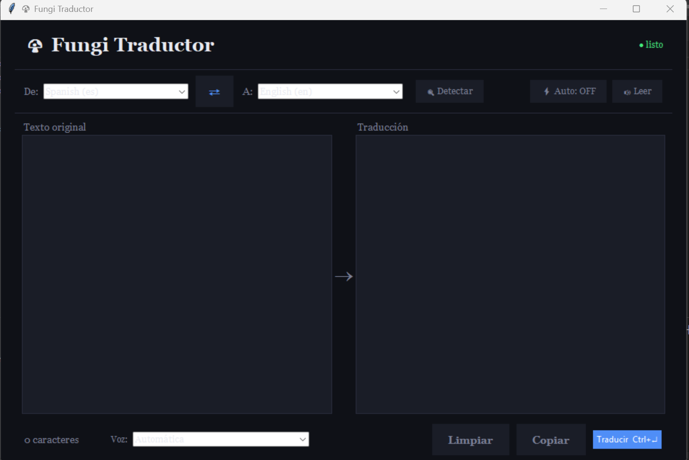

## 🍄 Fungi Traductor 

Traductor offline con interfaz gráfica construido con argostranslate + Tkinter.  
Arquitectura MVC modular, redimensionable y multi-idioma.

---
## 📚 Base del proyecto

Este proyecto utiliza Argos Translate como motor principal de traducción offline.

---

## 🚀 Instalación rápida

```git clone https://github.com/fiumgi/Fungi-Traductor```

```cd Fungi-Traductor```

```pip install -r requirements.txt```

```python app.py```

---

## ✨ Funcionalidades

| Función | Descripción |
|--------|------------|
| Multi-idioma | Combobox con idiomas disponibles |
| Swap ⇄ | Intercambia idiomas y textos |
| Scrollbars | Paneles con desplazamiento |
| Auto-traducción | Botón ⚡ Auto (debounce) |
| Detección | Usa langdetect |
| TTS | Texto a voz con pyttsx3 |
| Ajuste fuente | Ctrl + rueda |
| Logging | fungi_traductor.log |
| Responsive | UI redimensionable |
Permitir elegir manualmente la voz desde la interfaz.
Mostrar progreso más detallado durante descarga e instalación de paquetes.
---

## 🧱 Estructura del proyecto


Fungi-Traductor/
│
├── fungi_traductor/
│ ├── init.py
│ ├── model/
│ │ └── translator.py
│ ├── view/
│ │ └── gui.py
│ └── controller/
│ └── app_controller.py
│
├── app.py
├── pyproject.toml
├── requirements.txt
├── build_exe.bat
├── build_exe.sh
└── README.md


---

## 📦 Instalar como app (pipx)

pipx:
```pipx install git+https://github.com/fiumgi/Fungi-Traductor.git```

Luego ejecutar desde cualquier lugar:
```fungi-traductor```

---

## ⚙️ Crear ejecutable

### Windows
build_exe.bat

### Linux / macOS
```chmod +x build_exe.sh```

```./build_exe.sh```

---

## 🔌 Dependencias opcionales

```pip install langdetect``` 
/ detecta el idioma automaticamente 

```pip install pyttsx3```
/ sirve para la opcion de speak

---

## ⚠️ Notas

- No subir `dist/`, `build/`, `__pycache__/`
- Requiere Python 3.10+
## problemas en linux
Tkinter: Como recordarás, tkinter es parte de la librería estándar de Python. En Windows viene instalado por defecto, pero si algún usuario en Linux tiene problemas al ejecutarlo, deberá instalarlo desde su terminal (fuera de pip) con:

### Ubuntu/Debian: 
```sudo apt-get install python3-tk```

### Fedora: 
```sudo dnf install python3-tkinter```

### Uso con el build: Al haber incluido estas librerías aquí, los scripts build_exe.bat y build_exe.sh que creamos antes las instalarán automáticamente antes de empezar la compilación.

## 🙏 Créditos

Este proyecto está basado en:

### 📚 Librerías Utilizadas

* [Argos Translate](https://github.com/argosopentech/argos-translate) - Motor de traducción offline basado en OpenNMT.
* [langdetect](https://pypi.org/project/langdetect/) - Implementación en Python del detector de idiomas de Google.
* [pyttsx3](https://pyttsx3.readthedocs.io/) - Librería de conversión de texto a voz compatible con múltiples motores.

Todo el crédito de estas herramientas pertenece a sus respectivos autores.
